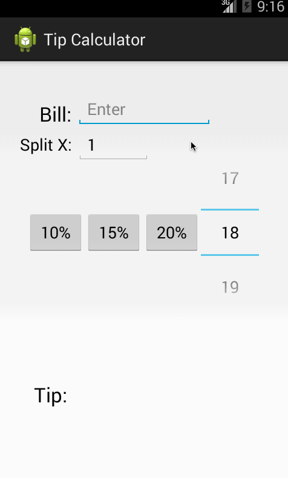

# Tip Calculator
<i> Android Intro Class - Assignment 1 - Tip Calculator </i>

## Author
- David Victor

## User Stories
- User is displayed the tip of specified percentage for specified entered amount
- User enters the total amount of the transaction
- User can select between tip amounts (i.e 10%, 15%, 20%)
- Upon selecting tip amount, formatted tip value is displayed
- **(Optional)** User changes the total amount and updated tip is reflected automatically
- **(Optional)** User can select custom tip percentage if desired
- **(Optional)** User can select how many ways to split the tip
- **(Optional)** User (1) custom percentage and (2) last used tip percentage (for immediate recalculation) persist across launches
- **(Optional)** Experiment with trying input widgets to replace the buttons and/or textviews

## Demo
 

## Reference
- [Assignment](https://yahoo.jiveon.com/docs/DOC-3185)